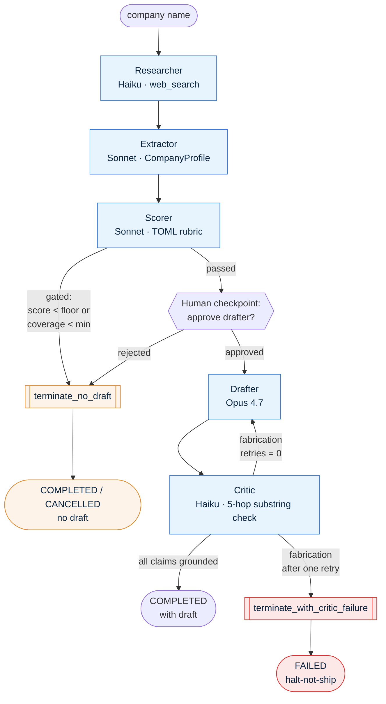

# agent-habitat

**Audit-grade multi-agent orchestration. Fabrication-resistance enforced as a validated contract, not a hope. Built for environments where _"we don't really know what the agent did"_ is not an acceptable answer.**

When the critic detects an unverifiable claim in a generated draft, the workflow halts as FAILED rather than ships. This isn't a hypothetical: in live calibration against Plaid (a real Tier-A scored fintech), the framework halted the run after two drafter attempts produced claims the substring-grounding check couldn't verify — at both old and new Opus pricing, in two separate calibration passes. Every reason for the halt — violating drafts, per-claim verdicts, the upstream signals the substring check ran against — is queryable from cold storage with no LLM in the loop.

agent-habitat runs a five-agent lead-enrichment crew end-to-end with persistent state, per-LLM-call cost telemetry, a human approval checkpoint before any user-visible draft is generated, and a critic agent that walks a five-hop substring chain over every claim the drafter makes — halting the workflow rather than shipping prose it can't ground.

The product is the habitat itself, not any specific workload. The lead-enrichment crew is the first workload exercising it; future workloads (research synthesis, code review, compliance triage) ride on the same infrastructure.

If you've built with CrewAI or vanilla LangGraph tutorials and hit the wall at "fine on the demo, but I can't tell you what the agent actually did" — that's the wall this project is built against.

---

## What makes it different

**1. Fabrication-resistance as a validated contract.** Every claim the drafter makes is decomposed by a critic agent and verified by a pure-Python substring check against the upstream evidence chain — researcher's `web_search` citations → extractor's source spans → scorer's grounded quotes → drafter prose. Five hops, no fuzzy matching, re-runnable from cold storage with no LLM in the loop. If any hop fails, the workflow gets one bounded retry; if the retry still fails, the workflow halts as FAILED rather than ships. ([ADR-006 §3](docs/adr/ADR-006-crew-architecture.md), [critic.py](src/agent_habitat/agents/critic.py))

**2. Audit-grade everything.** Every workflow row, every step, every typed event, every LLM call has a queryable cold-storage trail. SQLite for `workflows` / `workflow_steps` / `events`; JSONL telemetry per LLM call with model, tokens, USD cost, and `stop_reason`; LangGraph's `SqliteSaver` checkpoint blobs in the same `.db` file for cross-session resume. An auditor opens the `events` table and gets every reason the framework decided what it decided. ([ADR-002](docs/adr/ADR-002-persistence-schema.md))

**3. Bounded retry, then halt-not-ship.** Two independent retry budgets that compose cleanly: infrastructure retries inside `llm.complete()` for transient 429/5xx/network failures with `Retry-After` honoured ([ADR-007](docs/adr/ADR-007-llm-retry-policy.md)); and the orchestrator-level fabrication retry for stochastic grounding misses ([ADR-006 §1](docs/adr/ADR-006-crew-architecture.md)). Persistent failure on either axis halts loudly. The framework's job is never _to always ship_ — it's to never ship something it can't defend.

**4. Operator tunes outcomes; developers tune prompts.** The ICP rubric is TOML, operator-editable, scored with explicit per-dimension grounding. The scorer renormalises over scorable dimensions and surfaces a coverage number alongside the score. Agent prompts are inline `SYSTEM_PROMPT` constants at the top of each agent's `.py` module — versioned in git, code-reviewed, and changed only via PR. The split exists so the operator can iterate on outcomes (rubric weights, score floors, coverage minimums) without touching code. ([ADR-004](docs/adr/ADR-004-icp-rubric-format.md), [PATTERNS.md #5](docs/PATTERNS.md))

**5. Three-tier model routing, default down.** Haiku for the grunt work (researcher web_search, critic decomposition), Sonnet for the workhorse agents (extractor, scorer), Opus 4.7 only for the drafter where user-visible prose quality genuinely matters. No direct Anthropic SDK calls outside `llm.py`. ([ADR-001](docs/adr/ADR-001-langgraph-over-crewai.md), [llm.py](src/agent_habitat/llm.py))

---

## Live calibration evidence

<!-- ITEM-1-CALIBRATION-START -->

_Two real crew invocations against the live Anthropic API at current Opus 4.7 pricing (`$5/$25 per MTok`, in effect 2026-05-15 after Anthropic's mid-quarter repricing from `$15/$75`). Same observation format as Slice 8's four-company calibration._

| Company | Score / Tier | Coverage | Drafter ran? | Critic outcome | Workflow status | Total cost |
|---|---|---|---|---|---|---|
| **Anthropic** | 76.00 / B | 50% | yes (initial + 1 retry) | initial drafter had 4 ungrounded claims; **retry passed cleanly** | COMPLETED with draft | **$0.135** |
| **Plaid** | 100.00 / A | 50% | yes (initial + 1 retry) | initial had 3; **retry still had 1** | **FAILED — halt-not-ship** | **$0.111** |

**The Plaid run is the centerpiece.** Tier-A scored fintech company, drafter ran twice, critic refused to ship both times — the framework halted the workflow as FAILED rather than producing prose it couldn't ground. This is the third real-world halt-not-ship event the project has produced under live conditions (Slice 8 also halted Plaid at the old `$15/$75` Opus rates; the behaviour is stable across companies and across the rate change). The full audit trail is preserved on disk: the two violating drafts, both critic verdicts, the failed-claim explanations, the upstream signals the substring check ran against — every reason the framework decided not to ship, queryable from cold storage with no LLM call.

The critic's Mode-2 classifier flagged Plaid's final failed claim as `fixable_paraphrase` rather than `fabricated` — and the explanation pointed to an **upstream extractor artifact**: a source-span quote that had been truncated mid-word at `"accoun"`, so the drafter's faithful use of `"accounts"` legitimately failed the substring match. The substring check is the final arbiter and it caught the miss; the audit trail localises the root cause one upstream agent past the drafter. (Whether to pad source-span boundaries in the extractor to prevent this class of failure is a future ADR — out of scope for the current public push, but it's the kind of finding the audit chain makes possible to see.)

**Anthropic is the retry-fired-and-succeeded outcome.** The first drafter attempt produced four claims that failed the substring chain (stylistic edits — paraphrases, dropped suffixes). The retry, invoked with the critic's violation context attached, produced one claim that passed the mechanical chain end-to-end with zero Mode-2 LLM calls needed. The same pattern Slice 8 produced on Modal Labs replayed at new pricing.

**Cost finding worth noting.** At the new Opus rates, the **Researcher's `web_search` line items now dominate per-run cost** ($0.048–$0.067 for 2–3 searches) rather than the drafter ($0.020–$0.024 per Opus call, ~2.7× cheaper than Slice 8's $0.054–$0.063 — matching the 3× rate reduction). The "approve before drafting" checkpoint still pays back on rejected leads, but the savings calculus is closer to parity than the 2–4× Slice 8 dominance.

<!-- ITEM-1-CALIBRATION-END -->

**Historical reference — Slice 8 (2026-05-15, billed at the pre-reprice Opus rate of `$15/$75` per MTok).** Four companies; per-run total cost $0.066–$0.171, mean $0.126; the bounded-retry edge fired on 2 of 3 drafter-invoked runs (66%); of those, retry succeeded on 1 (Modal Labs) and failed-and-halted on 1 (Plaid, the framework's first audited halt-not-ship event in the wild). Full table in [ADR-006 §1](docs/adr/ADR-006-crew-architecture.md).

---

## Architecture

The Phase 2 lead-enrichment crew: five agents wired by a LangGraph `StateGraph`, one human checkpoint before the Opus drafter, one bounded retry on detected fabrication, two terminal-halt paths.



Underneath every node: the habitat's audit chain — `workflows` / `workflow_steps` / `events` rows in SQLite ([ADR-002](docs/adr/ADR-002-persistence-schema.md)), one JSONL telemetry line per LLM call via `llm.py`, LangGraph's `SqliteSaver` writing checkpoint blobs to the same `.db` file for cross-session resume.

**Stats:** 5,969 lines of source across `agents/` and `orchestration/`. 538 deterministic tests plus a handful of `@pytest.mark.live` smokes. `ruff check`, `ruff format --check`, `mypy --strict` all clean. Seven accepted ADRs covering every non-trivial decision.

---

## Walkthrough

**5-minute video demo:** [Watch on Loom](https://www.loom.com/share/6d0e715eae75445092a97d69862c55b0)

See the full crew run end-to-end against Plaid — checkpoint approval, the critic catching an ungrounded claim, the bounded retry, and the audit trail query.

---

## Quick start

Requires Python 3.13+ and an Anthropic API key.

```bash
git clone https://github.com/ktech7moon/agent-habitat.git
cd agent-habitat
python3 -m venv .venv
source .venv/bin/activate
pip install -e ".[dev]"
cp .env.example .env       # then edit .env: set ANTHROPIC_API_KEY=sk-...
```

Verify the install:

```bash
pytest -m "not live"       # 538 deterministic tests; no API calls, no cost
agent-habitat version
```

Run one crew invocation end-to-end (this will hit the live Anthropic API; expected cost at current pricing is **~$0.05–$0.09 for the upstream chain alone**, dominated by the Researcher's `web_search` line items, and **~$0.02–$0.05 more** if the drafter and critic run — typical full-crew runs land in the $0.11–$0.14 range, with a hard cap of `$10/day` for the `lead_enrichment` workflow type enforced by the budget tracker — see [`config/budgets.toml`](config/budgets.toml)):

```bash
agent-habitat run-crew "Anthropic"
```

The workflow will pause at the human checkpoint before the Opus drafter. Inspect and approve from a second terminal:

```bash
agent-habitat checkpoint list
agent-habitat checkpoint show <id>
agent-habitat checkpoint approve <id> --reviewer "Your Name"

# Or reject — the workflow is finalised CANCELLED with full audit.
agent-habitat checkpoint reject <id> --reviewer "Your Name" --reason "Out of ICP."
```

Resume after approval:

```bash
agent-habitat run-crew --resume <workflow_id>
```

Query the audit chain from cold storage (no LLM call needed):

```bash
sqlite3 data/state/agent_habitat.db <<'SQL'
.mode column
.headers on
SELECT id, status, started_at, finished_at, cost_total_usd FROM workflows ORDER BY started_at DESC LIMIT 5;
SELECT step_index, agent_name, status, cost_usd FROM workflow_steps WHERE workflow_id = (SELECT id FROM workflows ORDER BY started_at DESC LIMIT 1) ORDER BY step_index;
SQL
```

---

## What's inside

| Module | What it does | Lines |
|---|---|---|
| [`src/agent_habitat/agents/`](src/agent_habitat/agents/) | The five crew agents: `researcher` (Haiku + `web_search`), `extractor` (Sonnet → `CompanyProfile` with source spans), `scorer` (Sonnet, applies TOML rubric → `ScoredCompany`), `drafter` (Opus 4.7 → outreach prose with per-claim grounding), `critic` (Haiku, 5-hop substring chain). Plus `summarizer` (Phase 1 demo agent) and shared Pydantic `models.py`. | 3,804 |
| [`src/agent_habitat/orchestration/`](src/agent_habitat/orchestration/) | LangGraph state machine (`crew_graph.py`) + shared `CrewState` TypedDict + `run_step()` context manager that owns the audit envelope. | 1,365 |
| [`src/agent_habitat/llm.py`](src/agent_habitat/llm.py) | The **only** Anthropic SDK call site in the project (project rule, [CLAUDE.md](CLAUDE.md)). Routes every call through `complete()`, writes JSONL telemetry, applies the ADR-007 retry policy. | 531 |
| [`src/agent_habitat/state/`](src/agent_habitat/state/) | Pydantic v2 models + SQLite persistence + orphan reconciliation on startup + workflow / step / cost rollup utilities. | 789 |
| [`src/agent_habitat/observability/`](src/agent_habitat/observability/) | Canonical `EventType` taxonomy, `emit_event()`, structlog config, JSONL reader, `resolve_output_ref()`. | 470 |
| [`src/agent_habitat/checkpoint/`](src/agent_habitat/checkpoint/) | Human-in-the-loop primitive: `request_checkpoint` pauses the workflow with an audit row; `approve_checkpoint` / `reject_checkpoint` resolve and resume. CLI surface in `cli.py`. | 483 |
| [`src/agent_habitat/budget/`](src/agent_habitat/budget/) | TOML config (`config/budgets.toml`), per-workflow-type daily caps, pure `evaluate_budget()` query, `is_workflow_halted_by_budget()` halt-signal primitive. | 377 |
| [`src/agent_habitat/scoring/`](src/agent_habitat/scoring/) | Operator-tunable TOML rubric loader (`config/rubrics/default.toml`) + dimension validation + coverage computation. | 231 |

The seven accepted ADRs in [`docs/adr/`](docs/adr/) cover every non-trivial design decision: framework choice ([001](docs/adr/ADR-001-langgraph-over-crewai.md)), persistence schema ([002](docs/adr/ADR-002-persistence-schema.md)), web search tool ([003](docs/adr/ADR-003-web-search-tool.md)), rubric format ([004](docs/adr/ADR-004-icp-rubric-format.md)), the crew architecture + fabrication contract ([006](docs/adr/ADR-006-crew-architecture.md)), and the LLM retry policy ([007](docs/adr/ADR-007-llm-retry-policy.md)).

---

## Production considerations

agent-habitat is a framework. Deploying it leaves several boundaries to the operator. These are explicit, not implicit — and they're a feature, not a hedge. Most projects oversell; this one names what it doesn't ship.

**1. PII handling lives at the observability layer.** Per-LLM-call JSONL telemetry stores the verbatim prompt and verbatim response. For workloads that process PII (names, emails, financial data, regulated content), redaction must be installed at the observability layer before deployment — extend the JSONL writer in [`llm.py`](src/agent_habitat/llm.py) or pre-process records in `observability/jsonl.py`. The framework does not ship a redaction step; the right rule set is workload- and jurisdiction-specific.

**2. Human-in-the-loop is a primitive, not a turnkey approval system.** `CheckpointSystem` provides the durable, audit-logged approve/reject primitive that the orchestrator obeys. What ships: the durable mechanism. What does not ship: reviewer authentication and identity, notification fan-out (email, Slack, PagerDuty), an approval UI beyond the CLI, retention/deletion policy for resolved checkpoints, and "who approved this beyond log files" attestation. Those are deployment concerns; the audit row is the source of truth they should be built on top of.

**3. The system sometimes halts rather than draft.** Slice 8 calibration produced one halt-on-persistent-fabrication run out of three drafter-invoked runs (Plaid, Tier-A score, retry failed). This is the framework operating as designed: the bounded fabrication-retry edge ([ADR-006 §1](docs/adr/ADR-006-crew-architecture.md)) gives one chance to recover; persistent fabrication after that retry halts the workflow as FAILED rather than ship prose with unverified claims. Operators see the halt with full audit trail — the violating draft, the critic's per-claim verdicts, the upstream signals the substring check ran against. The differentiator versus systems that ship dubious prose is exactly this halt branch.

**4. Single-writer assumption.** [ADR-006 §1](docs/adr/ADR-006-crew-architecture.md) picked sequential execution: one workflow at a time per process, no parallel agents inside a workflow. The persistence layer ([ADR-002](docs/adr/ADR-002-persistence-schema.md)) and the telemetry writer (`llm.py::_append_telemetry`) assume single-writer-per-process today. Multiple workflows can run on the same database file from separate processes — WAL mode is enabled — but the in-memory line-count cache for telemetry assumes one writer per file. Genuinely concurrent workflows in one process need coordination at the persistence layer; cross-process telemetry coordination needs file-locking or off-process telemetry.

**5. LangGraph version pinning.** The orchestrator uses LangGraph's `SqliteSaver` for cross-session checkpoint resume ([ADR-001](docs/adr/ADR-001-langgraph-over-crewai.md), [ADR-006 §1](docs/adr/ADR-006-crew-architecture.md)). The checkpoint format is LangGraph-version-specific and the project is pinned to `langgraph>=1.2,<2`. Resume across major LangGraph upgrades is **not** guaranteed; the pin is intentional. Before rolling forward in production, run a paused-and-resumed workflow end-to-end against the new version and verify the audit trail is intact. Treat any LangGraph major bump as its own ADR (per [ADR-001](docs/adr/ADR-001-langgraph-over-crewai.md)).

**6. Cost calibration date.** The rates in `llm.py::_RATES_USD_PER_MTOK` are verified as of **2026-05-15**. Pricing changes invalidate the calibration; re-run a small calibration pass and bump the date stamp after any rate change. The `_RATES_USD_PER_MTOK` table is the single point that needs editing. Opus 4.7 was repriced from `$15/$75` to `$5/$25` per MTok during Phase 3 prep — the Live Calibration table above reflects the current rates; Slice 8's historical numbers in [ADR-006 §1](docs/adr/ADR-006-crew-architecture.md) reflect the prior rates and are preserved as audit-grade history.

**7. Retry policy.** `llm.complete()` retries transient infrastructure errors (429, 5xx, network/timeout) up to two times with exponential backoff and `Retry-After` honoured on 429s — [ADR-007](docs/adr/ADR-007-llm-retry-policy.md). The retry budget is per LLM call; the fabrication-retry edge ([ADR-006 §1](docs/adr/ADR-006-crew-architecture.md)) is a separate, independent budget at the orchestrator level. Persistent infrastructure failure (three transients in a row on the same call) halts the workflow as FAILED. Non-retryable errors (400/401/403/404/422) surface immediately without retry.

---

## Roadmap status

| Phase | Goal | Status |
|---|---|---|
| **Phase 1** | Habitat infrastructure: persistence, observability, cost + budget, checkpoints, single-agent demo | **Complete** |
| **Phase 2** | Five-agent lead-enrichment crew on the habitat: researcher → extractor → scorer → drafter → critic, LangGraph orchestration, bounded retry, calibrated against four companies | **Complete** |
| **Phase 3** | Public push: README polish, Mermaid architecture diagram, current-rate calibration re-baseline, Loom walkthrough, deliberate visibility flip | **Complete** (Loom walkthrough recording within 7 days — link to follow.) |

Detailed slice plan: [docs/ROADMAP.md](docs/ROADMAP.md). Project history and slice retros: [docs/PROJECT_HISTORY.md](docs/PROJECT_HISTORY.md).

**Deferred with named trigger conditions.** Each item has a specific cause that would lift it from "deferred" to "next ADR":

- **Parallel agent fanout** — trigger: a workload genuinely needs concurrent reads that the linear topology can't express.
- **PII redaction implementation** — trigger: first deployment into a PII-bearing workload. Today it's documented as a deployment concern, not built.
- **Checkpoint auth / notification fan-out** — trigger: first deployment with multiple reviewers or off-CLI approval surface.
- **Postgres / Redis / Celery / web UI / LangSmith / vector store** — each named in [CLAUDE.md](CLAUDE.md) with its specific trigger condition. Defaults are conservative: SQLite + JSONL + CLI cover Phase 1–3.

---

## Contact

Built by [Joseph](https://github.com/ktech7moon), a freelance senior software engineer building production AI agents in regulated industries (mortgage, healthcare middleware, compliance). If you're deploying agents where _"we don't really know what the agent did"_ isn't an acceptable answer, this codebase is the conversation starter. Open an issue, or reach out via GitHub.

## License

MIT. See [LICENSE](LICENSE).

## Acknowledgments

Built with [Anthropic Claude](https://www.anthropic.com/) (Haiku 4.5, Sonnet 4.6, Opus 4.7 — three-tier routing per [ADR-001](docs/adr/ADR-001-langgraph-over-crewai.md)) and [LangGraph](https://langchain-ai.github.io/langgraph/). The fabrication-resistance contract and audit-grade telemetry patterns are carry-forwards from prior portfolio projects, documented in [PATTERNS.md](docs/PATTERNS.md).
